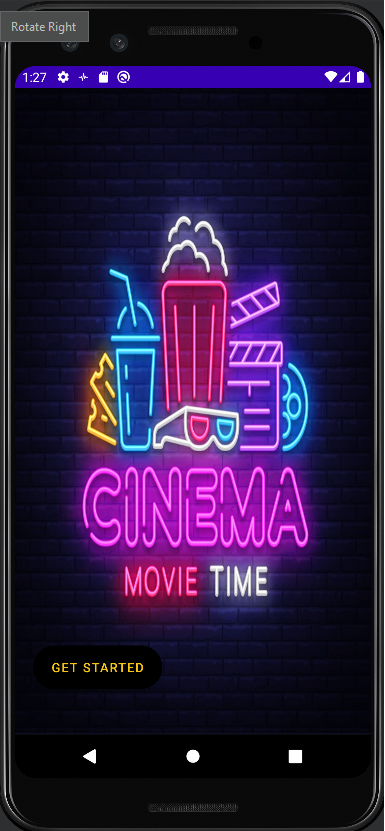
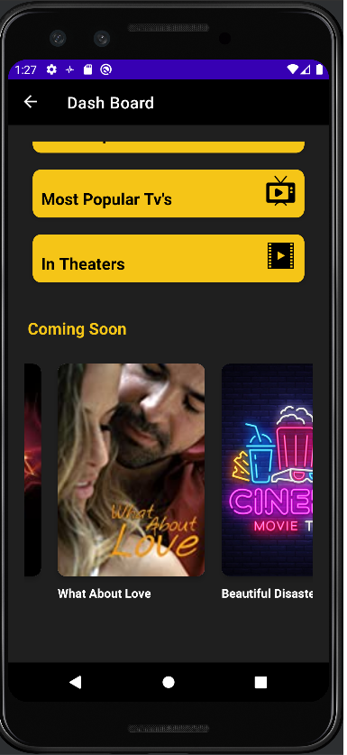
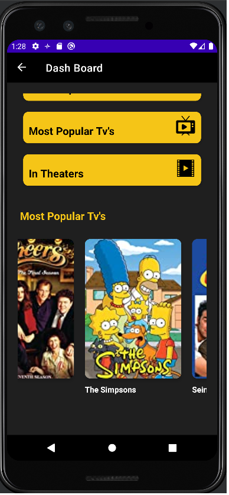
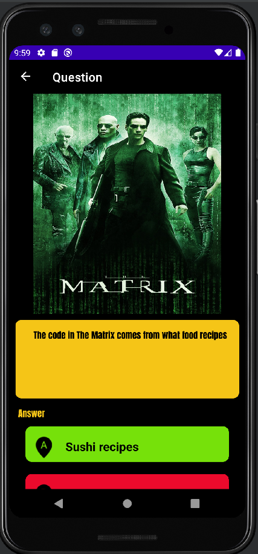
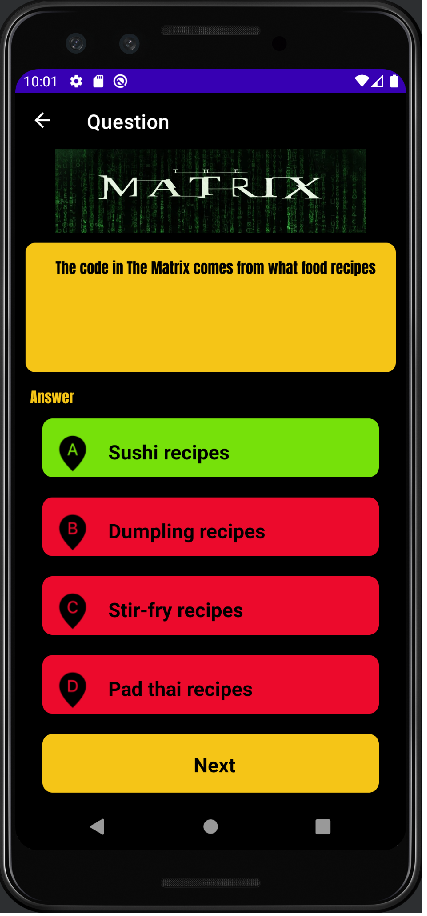
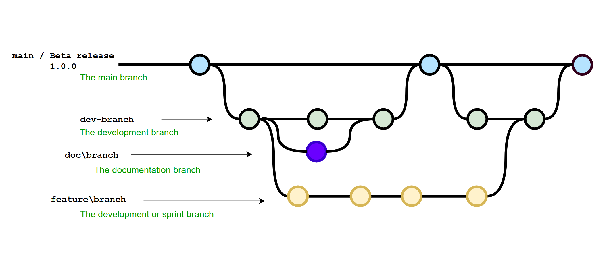

# Cinema Trivia

(Alpha Release)
Cinema Trivia is the perfect mobile app for cinephiles and movie buffs who want to challenge each other with their knowledge of the silver screen!

This two-player app pits you and your friend against each other in a battle of wits and movie trivia. With over 1,000 questions spanning all genres and eras, you'll be tested on everything from classic films to modern blockbusters. Earn points for correct answers and compete to see who knows the most about movies.

Movie Trivia also offers a variety of special game modes, like movie or actor-specific rounds, and a lightning round where you'll have to answer as many questions as possible within a set amount of time. And with its beautiful and intuitive interface, you'll be able to seamlessly switch between questions and view your score at any time.

Download Movie Trivia now and become a film expert!

    

## Das Team
Rivan Sevimli 

## Used Technologies

* room database
* coroutines
* Picaso
* Klaxon

## Branching-Modell

The developers create a feature branch directly from the dev-branch for each issue.
The following naming is observed: `feature/(IssueNr)-<branch name>`. In addition, for
documentation has opened its own branch. The following naming is observed: `doc/(IssueNr)-<branch name>`

Before a pull request is created by the developer, the following conditions must be met:

* Issue is fully implemented (in exceptional cases with `todo`)
* Clean code rules were observed, imports optimized and code formatted (by Intellij)
* Code is compilable

After the pull request has been approved, the feature branch is created by the creator
independently merged into the dev branch. The feature branch or the doc branch is then deleted.

## Working with Git
1.) Check if you have the latest version `Git update` or `Fetch`

2.) Local create its branch. Choose the branch name that matches the issue

3.) Before committing your changes, double check that you have the latest version
      merge if necessary and make adjustments if necessary

4.) For the commit message, give a short and accurate description of what was changed

5.) Push to git

6.) Create a pull request on GitHub

7.) Merge your own branch after the code has been approved

8.) Deleting a branch on GitHub

